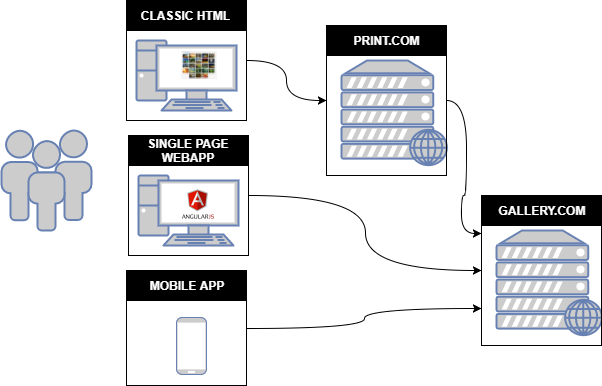

# OAuth 2.0: Security Considerations

## TL;DR

We show how to use OAuth 2.0 securely when using a [Classic Web Application](#classic-web-application-authorization-code-grant-flow),
a [Single Page Application](#single-page-application-implicit-grant-flow), and a [Mobile Application](#mobile-application-authorization-code-grant-with-pkce) as clients. For each of these clients, we  elaborate on the overall design, implement that design, and touch upon common security mistakes. You can exploit these mistakes by deploying the [damn vulnerable OAuth 2.0 applications](https://github.com/koenbuyens/Damn-Vulnerable-OAuth-2.0-Applications/blob/master/insecureapplication/README.md).

- [OAuth 2.0: Security Considerations](#oauth-20-security-considerations)
  - [TL;DR](#tldr)
  - [Introduction](#introduction)
  - [Running Example and Background](#running-example-and-background)
  - [An OAuth 2.0 Enabled Application: Architecture, Design, Implementation, and Testing: Common Mistakes](#an-oauth-20-enabled-application-architecture-design-implementation-and-testing-common-mistakes)
  - [Conclusion](#conclusion)
  - [References](#references)
    - [OAuth 2.0 Core](#oauth-20-core)
    - [Mobile and Other Devices](#mobile-and-other-devices)
    - [Token and Token Management](#token-and-token-management)
    - [Other Extensions](#other-extensions)
    - [Community Resources](#community-resources)
    - [Protocols Built on OAuth 2.0](#protocols-built-on-oauth-20)
  - [TODOs](#todos)

## Introduction

In this article, we elaborate on *common* security mistakes that architects and developers make when designing or implementing OAuth 2.0-enabled applications. The article not only describes these mistakes from a theoretical perspective, but also provides a set of working sample applications that contain those mistakes. This serves three purposes:

1. developers are able to identify a missing security control and learn how to implement it securely.
1. architects and developers are able to assess the impact of not implementing a security control.
1. Testers are able to identify the mistakes in a running application.

The article is structured as follows. Section [Background](#background) introduces the OAuth 2.0 Protocol using a running example. The subsequent sections show how to use OAuth 2.0 when using a [Classic Web Application](#classic-web-application-authorization-code-grant-flow), a [Single Page Application](#single-page-application-implicit-grant-flow), and [Mobile Application](#mobile-application-authorization-code-grant-with-pkce) as clients. For each of these sections, we  elaborate on the overall design, implement that design using the MEAN stack, and touch upon common security mistakes. Section [Checklists](#checklists) summarizes this article in the form of checklists for architects, developers, and testers. Finally, Section [Conclusion](#conclusion) concludes.

**Note:** the mistakes are common across technology stacks; we use the MEAN stack for illustration purposes only.

## Running Example and Background

Our canonical running example consists of a web site that enables users to manage pictures, named `gallery`.  This gallery application is similar to `flickr.com` in the sense that users can upload pictures, share them with friends, and organize those pictures in different albums.

 As our gallery application became quite popular, we got requests from various companies to integrate with our `gallery` application. To that end, we decided to open up the `REST API` that forms the foundation of our application towards those companies. These companies use the following types of clients:
- a third-party website that allows users to print the pictures hosted at our gallery site, named `photoprint`.
- a third-party mobile application that enables users to upload pictures, named `mypics`.
- a first-party mobile application that enables gallery users to upload pictures and change their profile, named `mobilegallery`.
- a single-page application displaying a live feed of a posted pictures, named `livepics`.

As we are concerned about security, users should be able to give those third-party applications permission to access their pictures without providing their username and password to those applications. It seems that the OAuth 2.0 protocol might help achieve our goals.

[OAuth 2.0](https://tools.ietf.org/html/rfc6749) is a [standard](https://tools.ietf.org/html/rfc6750) that enables users to give websites access to their data/services at other websites. For instance, a user gives a photo printing website access to her pictures on Flickr. Before performing a deep-dive into the specifics of OAuth 2.0, we introduce some definitions (taken from [auth0](https://auth0.com/docs/protocols/oauth2#oauth-roles)):

- ***Resource Owner***: the entity that can grant access to a protected resource. Typically this is the end-user.
- ***Client***: an application requesting access to a protected resource on behalf of the Resource Owner. This is also called a Relying Party.
- ***Resource Server***: the server hosting the protected resources. This is the API you want to access, in our case `gallery`.
- ***Authorization Server***: the server that authenticates the Resource Owner, and issues access tokens after getting proper authorization. This is also called an identity provider (IdP).
- ***User Agent***: the agent used by the Resource Owner to interact with the Client, for example a browser or a  mobile application.

In OAuth 2.0, the interactions between the user and her browser, the Authorization Server, and the Resource Server can be performed in four different flows.

1. the ***authorization code grant***: the *Client* redirects the user (*Resource Owner*) to an *Authorization Server* to ask the user whether the *Client* can access her *Resources*. After the user confirms, the *Client* obtains an *Authorization Code* that the *Client* can exchange for an *Access Token*. This *Access Token* enables the *Client* to access the *Resources* of the *Resource Owner*.
1. the ***implicit grant*** is a simplification of the authorization code grant. The Client obtains the *Access Token* directly rather than being issued an *Authorization Code*.
1. the ***resource owner password credentials grant*** enables the *Client* to obtain an *Access Token* by using the username and password of the *Resource Owner*.
1. the ***client credentials grant*** enables the *Client* to obtain an Access Token by using its own credentials.

Do not worry if you do not understand the flows right away. They are elaborated upon in detail in subsequent sections. What you should remember is that:

- *Clients* can obtain *Access Tokens* via four different flows.
- *Clients* use these access tokens to access an API.

## An OAuth 2.0 Enabled Application: Architecture, Design, Implementation, and Testing: Common Mistakes

You make many design decisions when architecting an OAuth 2.0 enabled application. Read [Architect: Major Design Decisions](architect.md) to understand the security impact of major design decisions, such as the selected OAuth 2.0 grant, the use of refresh tokens, and integrating with third parties.

Once you selected the grants, you need to make various local design decisions as well as implementation decisions.

- Read [Authorization Code Grant](authorizationcode.md) to understand how to use this grant for a classic web application.
  - Read [Developer: Minor Design Decisions and Insecure Implementation](authorizationcode_developer.md) to understand the common security pitfals and how to avoid them. 
  - Read [Tester: Exploit Mistakes](authorizationcode_tester.md) to understand how you can detect and exploit those common mistakes.
- Read [Implicit Grant](implicit.md) to understand how to use this grant for a Single-Page web application.
- Read [Resource Owner Password Credentials Grant](resourceowner.md) to understand how to use this flow with a first party mobile application.
- Read [Client Credentials Grant](clientcredentials.md) to understand how to use this flow in a B2B scenario.
- Read [Authorization Code Grant with PKCE](pkce.md) to understand how to use this grant for a third-party mobile application.

## Conclusion

In this article, we showed how to use OAuth 2.0 securely when using 

- a [Classic Web Application](#classic-web-application-authorization-code-grant-flow),
- a [Single Page Application](#single-page-application-implicit-grant-flow), and
- a [Mobile Application](#mobile-application-authorization-code-grant-with-pkce) as clients. For each of these clients, we  elaborated on the overall design, implemented that design using the MEAN stack, and touched upon common security mistakes.

## References

Partially taken from [https://oauth.net/2/](https://oauth.net/2/).

### OAuth 2.0 Core

- [OAuth 2.0 Framework - RFC 6749](http://tools.ietf.org/html/rfc6749)
- [OAuth 2.0 Grant Types](https://oauth.net/2/grant-types/)
  - [Authorization Code](https://tools.ietf.org/html/rfc6749#section-1.3.1)
  - [Implicit](https://tools.ietf.org/html/rfc6749#section-1.3.2)
  - [Password](https://tools.ietf.org/html/rfc6749#section-1.3.3)
  - [Client Credentials](https://tools.ietf.org/html/rfc6749#section-1.3.4)
  - [Device Code](https://tools.ietf.org/html/draft-ietf-oauth-device-flow-07#section-3.4)
  - [Refresh Token](https://tools.ietf.org/html/rfc6749#section-1.5)
- [OAuth 2.0 Bearer Tokens - RFC 6750](https://tools.ietf.org/html/rfc6750)
- [Threat Model and Security Considerations - RFC 6819](https://tools.ietf.org/html/rfc6819)

### Mobile and Other Devices

- [Native Apps - Recommendations for using OAuth 2.0 with native apps - RFC 8252](http://tools.ietf.org/html/rfc8252)
- [PKCE - Proof Key for Code Exchange, better security for native apps - RFC 7636](http://tools.ietf.org/html/rfc7636)
- [OAuth 2.0 Device Flow - RFC draft](https://tools.ietf.org/html/draft-ietf-oauth-device-flow)

### Token and Token Management

- [OAuth 2.0 Token Introspection - RFC 7662, to determine the active state and meta-information of a token](http://tools.ietf.org/html/rfc7662)
- [OAuth 2.0 Token Revocation - RFC 7009, to signal that a previously obtained token is no longer needed](http://tools.ietf.org/html/rfc7009)
- [JSON Web Token - RFC 7519](http://tools.ietf.org/html/rfc7519)

### Other Extensions

- [OAuth Assertions Framework - RFC 7521](http://tools.ietf.org/html/rfc7521)
- [SAML2 Bearer Assertion - RFC 7522, for integrating with existing identity systems](http://tools.ietf.org/html/rfc7522)
- [JWT Bearer Assertion - RFC 7523, for integrating with existing identity systems](http://tools.ietf.org/html/rfc7523)
- [OAuth WG Status Pages](https://tools.ietf.org/wg/oauth/)

### Community Resources

- [oauth.net](https://oauth.net/2/)
- [OAuth 2.0 Simplified](https://aaronparecki.com/oauth-2-simplified/)
- Books about OAuth
  - [OAuth 2.0 Simplified by Aaron Parecki](https://oauth2simplified.com/)
  - [OAuth 2 in Action by Justin Richer and Antonio Sanso](https://www.amazon.com/OAuth-2-Action-Justin-Richer/dp/161729327X/?tag=oauthnet-20)
  - [Mastering OAuth 2.0 by Charles Bihis](https://www.amazon.com/Mastering-OAuth-2-0-Charles-Bihis/dp/1784395404?tag=oauthnet-20)
  - [OAuth 2.0 Cookbook by Adolfo Eloy Nascimento](https://www.amazon.com/dp/178829596X?tag=oauthnet-20)
- [OAuth articles by Alex Bilbie](https://alexbilbie.com/tag/oauth/)

### Protocols Built on OAuth 2.0

- [OpenID Connect](http://openid.net/connect/)
- [UMA](https://docs.kantarainitiative.org/uma/rec-uma-core.html)
- [IndieAuth](https://indieauth.spec.indieweb.org/)

## TODOs

- Photoprint: implement obtaining a profile, authenticating, and storing orders (to illustrate OpenId connect).
- Gallery: refresh token, support for other grants.
- Classic Web App: remaining security considerations.
- Mobile Application: all
- SPA: all
