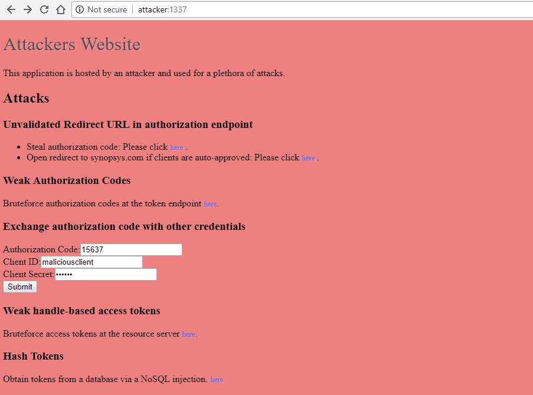
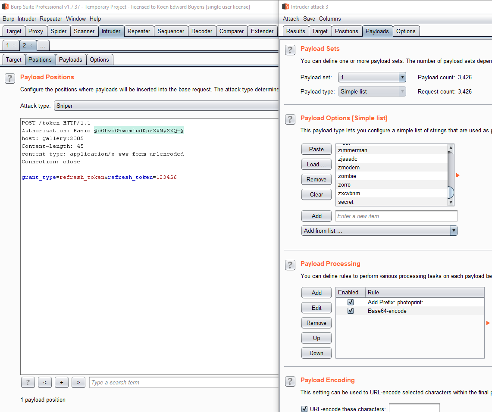

# Tester: Exploit Mistakes

In this section, we describe how you can exploit the common mistakes made when designing/implementing an OAuth 2.0 enabled application. This section lists a subset of what is listed in [RFC 6819](https://tools.ietf.org/html/rfc6819).

- [Tester: Exploit Mistakes](#tester-exploit-mistakes)
  - [Authorization Endpoint: Validate the RedirectURI Parameter](#authorization-endpoint-validate-the-redirecturi-parameter)
  - [Authorization Endpoint: Generate Strong Authorization Codes](#authorization-endpoint-generate-strong-authorization-codes)
  - [Authorization Endpoint: Expire Unused Authorization Codes](#authorization-endpoint-expire-unused-authorization-codes)
  - [Token Endpoint: Invalidate Authorization Codes After Use](#token-endpoint-invalidate-authorization-codes-after-use)
  - [Token Endpoint: Bind the Authorization Code to the Client](#token-endpoint-bind-the-authorization-code-to-the-client)
  - [Token Endpoint: Generate Strong Handle-Based Access and Refresh Tokens](#token-endpoint-generate-strong-handle-based-access-and-refresh-tokens)
  - [Token Endpoint: Store Handle-Based Access and Refresh Tokens Securely](#token-endpoint-store-handle-based-access-and-refresh-tokens-securely)
  - [Token Endpoint: Expire Access and Refresh Tokens](#token-endpoint-expire-access-and-refresh-tokens)
  - [Token Endpoint: Store Client Secrets Securely](#token-endpoint-store-client-secrets-securely)
  - [Use Strong Client Secrets](#use-strong-client-secrets)
  - [Implement Rate-Limiting](#implement-rate-limiting)
  - [Token Endpoint: Bind Refresh Token to Client](#token-endpoint-bind-refresh-token-to-client)
  - [Resource Server: Reject Revoked Tokens](#resource-server-reject-revoked-tokens)
  - [Token Endpoint: Limit Token Scope](#token-endpoint-limit-token-scope)
  - [Resource Server: Validate Token Scope](#resource-server-validate-token-scope)
  - [OAuth 2.0 Client: CSRF](#oauth-20-client-csrf)
  - [OAuth 2.0 Client: Store Client Secrets Securely](#oauth-20-client-store-client-secrets-securely)
  - [OAuth 2.0 Client: Store Access and Refresh Tokens Securely](#oauth-20-client-store-access-and-refresh-tokens-securely)
  - [Checklist](#checklist)

## [Authorization Endpoint: Validate the RedirectURI Parameter](https://tools.ietf.org/html/rfc6819#section-4.2.4)

If the authorization server does not validate that the redirect URI belongs to the client, it is susceptible to two types of attacks.

- [Open Redirect](https://tools.ietf.org/html/rfc6819#section-4.2.4) enables attackers to redirect the victim to a site of their liking.
    
- Account hijacking by stealing authorization codes. If an attacker redirects to a site under their control, the authorization code - which is part of the URI - is given to them. They may be able to exchange it for an access token and thus get access to the user's resources (if the client credentials are compromised or not necessary).
    

To validate this as a tester, do the following:

1. Capture the URL that the OAuth 2.0 client uses to talk with the authorization endpoint.  `http://gallery:3005/oauth/authorize?response_type=code&redirect_uri=http%3A%2F%2Fphotoprint%3A3000%2Fcallback&scope=view_gallery&client_id=photoprint`
2. Change the value of the redirect_uri parameter to one you control.  `http://gallery:3005/oauth/authorize?response_type=code&redirect_uri=http%3A%2F%2Fattacker%3A1337%2Fcallback&scope=view_gallery&client_id=photoprint`
    One can use many payloads for redirect URI, including but not limited to.
    - If the redirect URI accepts external URLs, such as accounts.google.com, then use a redirector in that external URL to redirect to any website [https://accounts.google.com/signout/chrome/landing?continue=https://appengine.google.com/_ah/logout?continue%3Dhttp://attacker:1337](https://accounts.google.com/signout/chrome/landing?continue=https://appengine.google.com/_ah/logout?continue%3Dhttp://attacker:1337)
    - Use any of the regular bypasses
        - `http://example.com%2f%2f.victim.com`
        - `http://example.com%5c%5c.victim.com`
        - `http://example.com%3F.victim.com`
        - `http://example.com%23.victim.com`
        - `http://victim.com:80%40example.com`
        - `http://victim.com%2eexample.com`

## [Authorization Endpoint: Generate Strong Authorization Codes](https://tools.ietf.org/html/rfc6819#section-4.4.1.3)

If the authorization codes are weak, an attacker may be able to guess them at the token endpoint. This is especially true if the client secret is compromised, not used, or not validated. 

To validate this as a tester, analyze the entropy of multiple captured authorization codes.

1. Configure BurpSuite and intercept the request that the OAuth 2.0 client sends to the OAuth 2.0 Authorization Endpoint.

2. Send that request to BurpSuite Sequencer.  

3. Select the request in sequencer and define a custom token location. Select the location of the token.  

4. Select 'live capture' and subsequently click 'Analyze now'. The result tells whether the tokens have sufficient entropy. 

Alternatively, bruteforce the tokens if you have a compromised client secret or if the client secret is not necessary. This is the approach the attacker took.

## [Authorization Endpoint: Expire Unused Authorization Codes](https://tools.ietf.org/html/rfc6819#section-5.1.5.4)

Expiring unused authorization codes limits the window in which an attacker can use captured or guessed authorization codes.

To validate this as a tester, obtain an authorization code but only redeem it after 31 minutes.

1. Configure BurpSuite and intercept the request that the OAuth 2.0 client sends to the OAuth 2.0 Authorization Endpoint.
2. Send that request to the BurpSuite Plugin 'Session Timeout Test'.  
3. Configure the plugin by selecting a matching string that indicates the authorization code is invalid (typically 'Unauthorized') and a mininmum timeout of 31 minutes.  
4. Observe the result.

## [Token Endpoint: Invalidate Authorization Codes After Use](https://tools.ietf.org/html/rfc6819#section-5.1.5.4)

Invalidating used authorization codes limits the window in which an attacker can use captured or guessed authorization codes.

To validate this as a tester, obtain an authorization code and redeem it twice.

1. Configure BurpSuite and intercept the request that the OAuth 2.0 client sends to the OAuth 2.0 Authorization Endpoint.
2. Send that request to BurpSuite Repeater.
3. Repeat that request and validate whether it fails.

## [Token Endpoint: Bind the Authorization Code to the Client](https://tools.ietf.org/html/rfc6819#section-5.2.4.4)

An attacker can exchange captured or guessed authorization codes for access tokens by using the credentials for another, potentially malicious, client.


To validate this as a tester, obtain an authorization code (guessed or captured) for an OAuth 2.0 client and exchange with another client.

```http
POST /oauth/token HTTP/1.1
host: gallery:3005
Content-Length: 133
Connection: close

code=9&redirect_uri=http%3A%2F%2Fphotoprint%3A3000%2Fcallback&grant_type=authorization_code&client_id=maliciousclient&client_secret=secret
```

## [Token Endpoint: Generate Strong Handle-Based Access and Refresh Tokens](https://tools.ietf.org/html/rfc6819#section-5.1.4.2.2)

If the tokens are weak, an attacker may be able to guess them at the resource server or the token endpoint. 

To validate thas a tester, analyze the entropy of multiple captured tokens. Note that it is hard to capture tokens for clients that are classic web applications as these tokens are communicated via a back-channel1. Identitify the location of the token endpoint. Most OAuth servers with openID/Connect support publish the locations of their endpoints at `https://[base-server-url]/.well-known/openid-configuration` or at `https://[base-server-url]/.well-known/oauth-authorization-server`. If such endpoint is not available, the token endpoint is usually hosted at token. .

1. Make requests to the token endpoint with valid authorization codes or refresh tokens and capture the resulting access tokens. Note that the client ID and secret are typically required. They may be in the body or as a Basic Authorization header.

    ```http
    POST /token HTTP/1.1
    host: gallery:3005
    Content-Length: 133
    Connection: close

    code=9&redirect_uri=http%3A%2F%2Fphotoprint%3A3000%2Fcallback&
    grant_type=authorization_code&client_id=maliciousclient&client_secret=secret
    ```

2. Analyze the entropy of these tokens using the same approach as described in weak authorization codes.

Alternatively, bruteforce the tokens at the resource server if you have a compromised client secret or if the client secret is not necessary. The attacker above followed this approach.

## [Token Endpoint: Store Handle-Based Access and Refresh Tokens Securely](https://tools.ietf.org/html/rfc6819#section-4.5.2)

If the handle-based tokens are stored as plain text, an attacker may be able to obtain them from the database at the resource server or the token endpoint.



To validate this as a tester, obtain the contents of the database via a NoSQL/SQL injection attack, and validate whether the tokens have been stored unhashed. Note that it is better to validate this using a code review.

## [Token Endpoint: Expire Access and Refresh Tokens](https://tools.ietf.org/html/rfc6819#section-5.1.5.3)

Expiring access and refresh tokens limits the window in which an attacker can use captured or guessed tokens.

To validate this as a tester, obtain an access token but only redeem it after 31 minutes.

## [Token Endpoint: Store Client Secrets Securely](https://tools.ietf.org/html/rfc6819#section-5.3.3)

If the client secrets are stored as plain text, an attacker may be able to obtain them from the database at the resource server or the token endpoint.

To validate this as a tester, obtain the contents of the database via a NoSQL/SQL injection attack and validate whether the secrets have been stored unhashed. Note that it is better to validate this using a code review.

## Use Strong Client Secrets

If the client secrets are weak, an attacker may be able to guess them at the token endpoint.

To validate this as a tester, perform a bruteforce attack on the secret at the token endpoint.

1. Use BurpSuite Intruder to guess client secrets. Use `Simple list` as payload type, select a password dictionary, add a prefix (client ID and colon) to the password and base64 encode the result.
2. Observe the result.



Alternatively, analyze the entropy of multiple captured secrets. Note that it is hard to capture secrets for clients that are classic web applications as these secrets are communicated via a back-channel.

## Implement Rate-Limiting

To prevent bruteforcing, OAuth 2.0 endpoints should implement rate limiting as it slows down an attacker.

To validate this as a tester, try any of the previously listed bruteforcing attacks.

## Token Endpoint: Bind Refresh Token to Client

If the binding between a refresh token and the client is not validated, a malicious client may be able to exchange captured or guessed refresh tokens for access tokens. This is especially problematic if the application allows automatic registration of clients.

To validate this as a tester, exchange a refresh token that was previously issued for one client with another client. Note, this requires access to multiple clients and their client secrets.

## Resource Server: Reject Revoked Tokens

TODO

## Token Endpoint: Limit Token Scope

TODO

## Resource Server: Validate Token Scope

TODO

## OAuth 2.0 Client: CSRF

TODO

## OAuth 2.0 Client: Store Client Secrets Securely

If the client secrets are stored insecurely, an attacker may be able to obtain them.

Validate this during a code review.

## OAuth 2.0 Client: Store Access and Refresh Tokens Securely

If the handle-based tokens are stored as plain text in a database, an attacker may be able to obtain them from the database at the client.

Validate this during a code review.

## Checklist

- Identify the locations of the different endpoints. Most OAuth servers with openID/Connect support publish the locations of their endpoints at [https://[base-server-url]/.well-known/openid-configuration](https://[base-server-url]/.well-known/openid-configuration) or at [https://[base-server-url]/.well-known/oauth-authorization-server](https://[base-server-url]/.well-known/oauth-authorization-server).
- Authorization Endpoint
  - [ ] Open redirect at the `redirect_uri` parameter of the Authorization Endpoint.
  - [ ] Check entropy of authorization codes at the Authorization Endpoint. Alternatively, try bruteforcing them.
  - [ ] Validate whether you can request more scope than permissable for your client.
- Token Endpoint
  - [ ] Validate whether authorization codes are expired within 30 minutes if unused.
  - [ ] Validate whether authorization codes can only be used once.
  - [ ] Validate whether authorization codes can be exchanged for access tokens by a different client.
  - [ ] Check whether client secrets are passed in request body or Authorization header.
  - [ ] Check entropy of client secret.
  - [ ] Validate whether Client ID and secret are validated.
  - [ ] Check whether refresh tokens expire within 1 year (depends on appetite for business risk; anything between a day and 1 year is acceptable).
  - [ ] Check whether a different client can exchange the refresh token than the one that obtained it.
  - [ ] Check whether rate limiting has been implemented (to avoid bruteforce of credentials, authorization codes, or refresh tokens).
  - [ ] Check whether the client is not locked out on bruteforce attacks against the client secret.
  - [ ] Check entropy of generated handle-based access and refresh tokens.
  - [ ] Check whether access and refresh tokens are in the response body.
  - [ ] Check whether the response has appropriate caching headers.
- Resource Server
  - [ ] Check whether access tokens expire within 1 hour.
  - [ ] Check whether access and refresh tokens are in a request header or a request body.
  - [ ] Check whether invalid tokens are rejected.
    - [ ] expired
    - [ ] revoked
    - JWTs
      - [ ] generated for different resource server
      - [ ] signed by a different issuer (e.g. yourself).
      - [ ] revoked signing key/certificate
      - [ ] signed with the none algorithm
      - [ ] signed using symmetric algorithm and the public key as secret key
  - [ ] Check whether you can access an API that requires scope that you do not have.
